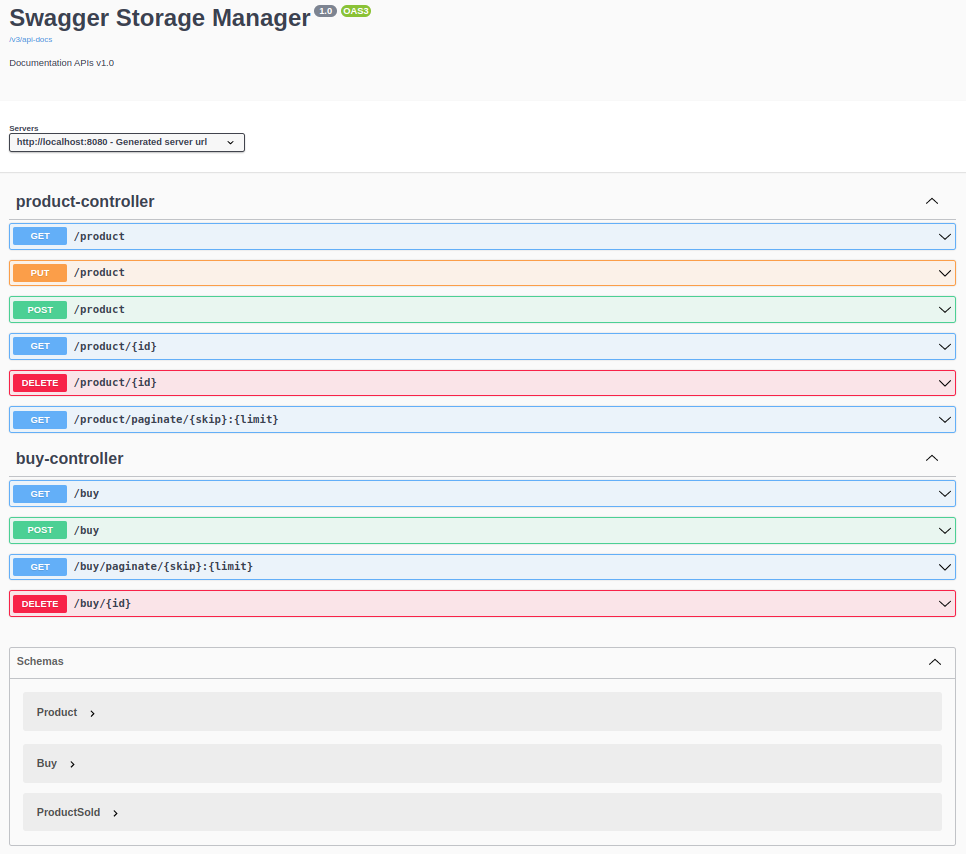
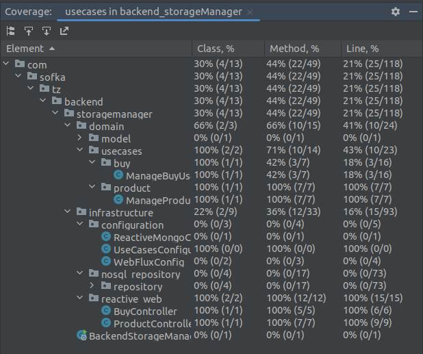

# Welcome to the storage manager

## Build with
- Spring Boot
- WebFlux
- Maven
- Springdoc-openapi
- Docker/Podman

## Database
- Mongo reactive
- Docker mongo

## Pre-requisites (If you want to run the project with docker)
- Docker desktop
- [See Docker desktop ](https://www.docker.com/products/docker-desktop/)
- Podman desktop
- [See Podman desktop ](https://podman-desktop.io/)

## Running the project
- Clone the project
- mvn clean
- mvn package
- run docker-compose build
- run docker-compose up
- Try with Postman or Swagger
- Enjoy..

## Docker CLI
- docker-compose build -> Build the project from the Dockerfile
- docker-compose up -> Raise the project
- docker-compose down -> Down the project
- docker-compose ps -> Watch the containers running

## Swagger URL
- HOST:PORT/webjars/swagger-ui/index.html
- HOST:PORT/v3/api-docs
- 

## test coverage
